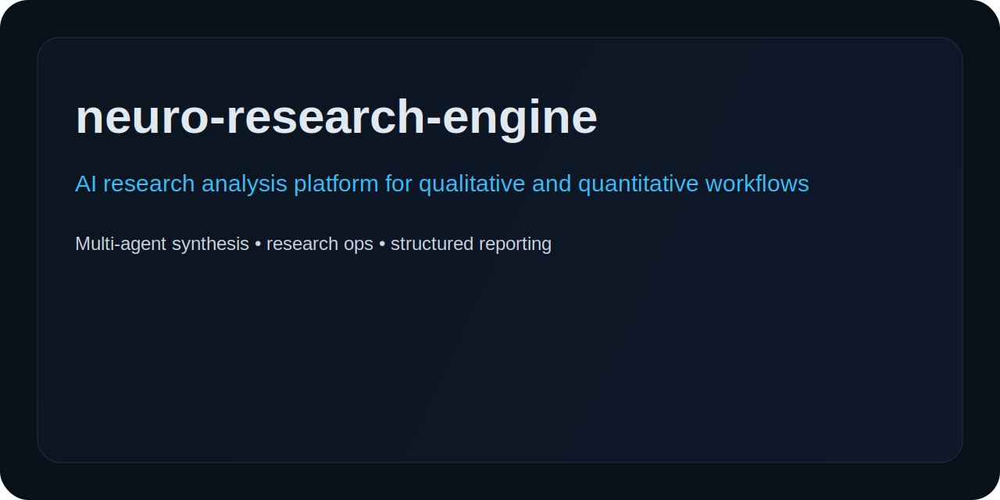

# Neuro Research Engine

AI-powered research analysis platform for **qualitative synthesis**, **quantitative interpretation**, and **multi-agent research workflows**.



This repository is now packaged with a stronger public maintenance layer for GitHub search and ranking: contributor files, security guidance, repo-health automation, and lightweight CI.

[](https://www.python.org/downloads/)
[](https://opensource.org/licenses/MIT)
[](https://github.com/psf/black)

## Overview

**Neuro Research Engine** is a hyper-technical, production-grade AI-powered research analysis system for comprehensive qualitative and quantitative data analysis using OpenAI LLMs with a multi-agent architecture.

### Key Features

- **Multi-Agent Analysis Pipeline**
  - `QualitativeAgent`: Thematic analysis, entity extraction, sentiment detection, pattern recognition
  - `QuantitativeAgent`: Statistical summaries, correlation analysis, distribution fitting, trend detection
  - `SynthesisAgent`: Cross-validation, recommendation generation, executive summary creation

- **Advanced Data Ingestion**
  - URL fetching with async support, retry logic, and HTML parsing
  - Multi-format file parsing (CSV, JSON, TXT, XLSX, MD)
  - Raw text preprocessing with normalization

- **Comprehensive Output Schema**
  - Structured JSON reports with Pydantic validation
  - Rich terminal output with formatted tables
  - Executive summaries and actionable recommendations

- **Production-Ready Architecture**
  - Type-safe configuration with environment validation
  - Comprehensive error handling and logging
  - Async processing capabilities
  - Integration hooks for webhooks, Slack, Discord

---

## Repository Structure

```
neuro-research-engine/
├── __init__.py              # Package initialization
├── config.py                # Configuration management with Pydantic
├── models.py                # Pydantic data models for validation
├── audit_engine.py          # Main orchestration engine
├── main.py                  # CLI entry point with rich output
├── requirements.txt         # Python dependencies
├── .env.example            # Environment variable template
├── .gitignore              # Git ignore rules
├── README.md               # This documentation
│
├── agents/                 # Analysis agents
│   ├── __init__.py
│   ├── qualitative_agent.py    # Thematic & sentiment analysis
│   ├── quantitative_agent.py   # Statistical analysis
│   └── synthesis_agent.py      # Cross-validation & synthesis
│
├── utils/                  # Utility modules
│   ├── __init__.py
│   └── data_ingestion.py       # Data fetching & parsing
│
├── integrations/           # External integrations
│   └── __init__.py
│
├── tests/                  # Test suite
│   └── __init__.py
│
└── reports/                # Output directory
    └── .gitkeep
```

---

## Installation

### Prerequisites

- Python 3.10 or higher
- pip package manager
- OpenAI API key

### Setup Steps

```bash
# Clone repository
git clone https://github.com/Crynge/neuro-research-engine.git
cd neuro-research-engine

# Create virtual environment
python -m venv venv

# Activate virtual environment
# On Linux/macOS:
source venv/bin/activate
# On Windows:
venv\Scripts\activate

# Install dependencies
pip install -r requirements.txt

# Download NLP resources
python -c "import nltk; nltk.download('punkt'); nltk.download('vader_lexicon')"

# Configure environment
cp .env.example .env

# Edit .env and set your OpenAI API key
# OPENAI_API_KEY=sk-your-actual-api-key-here
```

---

## Usage

### Basic Commands

```bash
# Analyze a URL (mixed mode)
python main.py --url "https://example.com/article" --output article_analysis

# Analyze a CSV file (quantitative mode)
python main.py --file survey_results.csv --mode quantitative --output survey_stats

# Analyze raw text (qualitative mode)
python main.py --text "Customer feedback text here..." --mode qualitative --output feedback

# Full mixed analysis with custom instructions
python main.py --url "https://example.com" \
    --mode mixed \
    --instructions "Focus on customer sentiment and pain points" \
    --output full_analysis
```

### CLI Options

| Option | Short | Description | Default |
|--------|-------|-------------|---------|
| `--url` | `-u` | URL to analyze | - |
| `--file` | `-f` | File path (CSV, JSON, TXT, XLSX) | - |
| `--text` | `-t` | Raw text to analyze | - |
| `--mode` | `-m` | Analysis mode: qualitative, quantitative, mixed | mixed |
| `--instructions` | `-i` | Custom analysis instructions | - |
| `--output` | `-o` | Output report name | analysis_report |
| `--output-dir` | - | Output directory | reports |
| `--verbose` | `-v` | Enable verbose output | False |
| `--reload-config` | - | Reload configuration from .env | False |

---

## Output Format

### JSON Report Schema

```json
{
  "report_id": "rpt_abc123def456",
  "timestamp": "2024-01-15T10:30:00Z",
  "source_url": "https://example.com",
  "analysis_mode": "mixed",
  
  "qualitative": {
    "themes": [
      {
        "name": "Customer Satisfaction",
        "description": "Recurring mentions of product satisfaction",
        "confidence": 0.89,
        "frequency": 45,
        "supporting_quotes": ["..."],
        "sentiment": "positive"
      }
    ],
    "entities": [...],
    "sentiment": {
      "overall_sentiment": "positive",
      "polarity_score": 0.65,
      "subjectivity_score": 0.72,
      "emotion_distribution": {"joy": 0.4, "anger": 0.1, ...}
    },
    "key_insights": [...],
    "patterns": [...],
    "word_count": 5420,
    "unique_concepts": 342
  },
  
  "quantitative": {
    "summaries": {
      "revenue": {
        "count": 100,
        "mean": 15234.56,
        "median": 14500.00,
        "std_dev": 3421.12,
        ...
      }
    },
    "correlations": {...},
    "distributions": {...},
    "outliers": [...],
    "trends": [...],
    "sample_size": 500,
    "missing_data_ratio": 0.02
  },
  
  "cross_validations": [
    {
      "qualitative_theme": "Customer Satisfaction",
      "quantitative_support": "High NPS scores correlate with positive sentiment",
      "alignment_score": 0.87,
      "contradictions": []
    }
  ],
  
  "recommendations": [
    {
      "id": "rec_001",
      "title": "Improve Response Time",
      "priority": "high",
      "confidence": "high",
      "evidence": [...],
      "implementation_steps": [...],
      "expected_impact": "15% improvement in CSAT"
    }
  ],
  
  "executive_summary": "...",
  "key_findings": [...],
  "limitations": [...],
  "processing_time_ms": 4523,
  "tokens_used": 2341,
  "model_used": "gpt-4-turbo-preview",
  "confidence_overall": 0.85
}
```

### Terminal Output

The CLI produces rich formatted output including:
- 📊 Analysis Metadata table
- 🔍 Key Findings list
- 📝 Qualitative Analysis summary
- 📈 Quantitative Analysis summary
- 💡 Prioritized Recommendations
- 📋 Executive Summary panel

---

## Configuration

### Environment Variables (.env)

| Variable | Description | Default |
|----------|-------------|---------|
| `OPENAI_API_KEY` | OpenAI API key (required) | - |
| `OPENAI_BASE_URL` | API base URL | https://api.openai.com/v1 |
| `OPENAI_MODEL` | LLM model to use | gpt-4-turbo-preview |
| `OPENAI_MAX_TOKENS` | Max response tokens | 4096 |
| `OPENAI_TEMPERATURE` | Generation temperature | 0.2 |
| `ANALYSIS_TIMEOUT` | Analysis timeout (seconds) | 120 |
| `MAX_RETRIES` | Maximum retry attempts | 3 |
| `BATCH_SIZE` | Batch processing size | 50 |
| `CONFIDENCE_THRESHOLD` | Minimum confidence score | 0.75 |
| `REQUEST_TIMEOUT` | HTTP request timeout | 30 |
| `LOG_LEVEL` | Logging level | INFO |

---

## Integration Guide

### Automation with n8n

```json
{
  "nodes": [
    {
      "name": "HTTP Request",
      "type": "n8n-nodes-base.httpRequest",
      "parameters": {
        "method": "POST",
        "url": "={{ $env.WEBHOOK_URL }}",
        "body": {
          "url": "={{ $json.pageUrl }}",
          "mode": "mixed",
          "output": "webhook_analysis"
        }
      }
    }
  ]
}
```

### Cron Job Setup

```bash
# Run analysis every hour
0 * * * * cd /path/to/neuro-research-engine && \
    source venv/bin/activate && \
    python main.py --url "https://example.com" --output hourly_report >> logs/cron.log 2>&1
```

### GitHub Actions Workflow

```yaml
name: Research Analysis
on:
  schedule:
    - cron: '0 6 * * *'  # Daily at 6 AM

jobs:
  analyze:
    runs-on: ubuntu-latest
    steps:
      - uses: actions/checkout@v4
      - name: Set up Python
        uses: actions/setup-python@v5
        with:
          python-version: '3.10'
      - name: Install dependencies
        run: pip install -r requirements.txt
      - name: Run analysis
        env:
          OPENAI_API_KEY: ${{ secrets.OPENAI_API_KEY }}
        run: python main.py --url "https://example.com" --output daily_report
      - name: Upload report
        uses: actions/upload-artifact@v4
        with:
          name: analysis-report
          path: reports/*.json
```

### Webhook Integration

```python
# Send results to webhook
import requests
from audit_engine import AuditEngine

engine = AuditEngine()
report = engine.run(url="https://example.com")

requests.post(
    "https://your-webhook.com/endpoint",
    json=report.model_dump(mode='json'),
    headers={"Authorization": "Bearer YOUR_TOKEN"}
)
```

### Slack Notification

```python
# Send summary to Slack
import requests

def send_slack_notification(report: ResearchReport, webhook_url: str):
    blocks = [
        {
            "type": "header",
            "text": {"type": "plain_text", "text": f"📊 Analysis Complete: {report.report_id}"}
        },
        {
            "type": "section",
            "text": {"type": "mrkdwn", "text": f"*Mode:* {report.analysis_mode.value}\n*Confidence:* {report.confidence_overall:.0%}"}
        }
    ]
    
    requests.post(webhook_url, json={"blocks": blocks})
```

---

## Development

### Running Tests

```bash
# Install test dependencies
pip install pytest pytest-asyncio pytest-cov

# Run tests
pytest tests/ -v --cov=.

# Run with coverage report
pytest tests/ --cov=. --cov-report=html
```

### Code Quality

```bash
# Format code
black .

# Type checking
mypy .

# Linting
flake8 .
```

---

## API Reference

### AuditEngine

```python
from audit_engine import AuditEngine
from models import AnalysisMode

engine = AuditEngine()

# Run complete analysis
report = engine.run(
    url="https://example.com",
    mode=AnalysisMode.MIXED,
    custom_instructions="Focus on technical content",
    output_name="my_report"
)

# Save report
engine.save_report(report, "my_report")
```

### Individual Agents

```python
from agents.qualitative_agent import QualitativeAgent
from agents.quantitative_agent import QuantitativeAgent

# Qualitative only
qual_agent = QualitativeAgent()
qual_result = qual_agent.analyze("Your text here...")

# Quantitative only
quant_agent = QuantitativeAgent()
quant_result = quant_agent.analyze({"variable": [1, 2, 3, 4, 5]})
```

---

## Troubleshooting

### Common Issues

**API Key Error**
```
Error: OPENAI_API_KEY not configured
```
→ Copy `.env.example` to `.env` and set your API key

**Import Errors**
```
ModuleNotFoundError: No module named 'xxx'
```
→ Ensure virtual environment is activated and dependencies installed

**Timeout Errors**
```
DataIngestionError: Failed to fetch URL after 4 attempts
```
→ Increase `REQUEST_TIMEOUT` in `.env` or check network connectivity

---

## License

MIT License - see LICENSE file for details.

---

## Contributing

1. Fork the repository
2. Create a feature branch (`git checkout -b feature/amazing-feature`)
3. Commit changes (`git commit -m 'Add amazing feature'`)
4. Push to branch (`git push origin feature/amazing-feature`)
5. Open a Pull Request

---

## Support

For issues and feature requests, please open an issue on GitHub.

**Repository:** https://github.com/Crynge/neuro-research-engine
